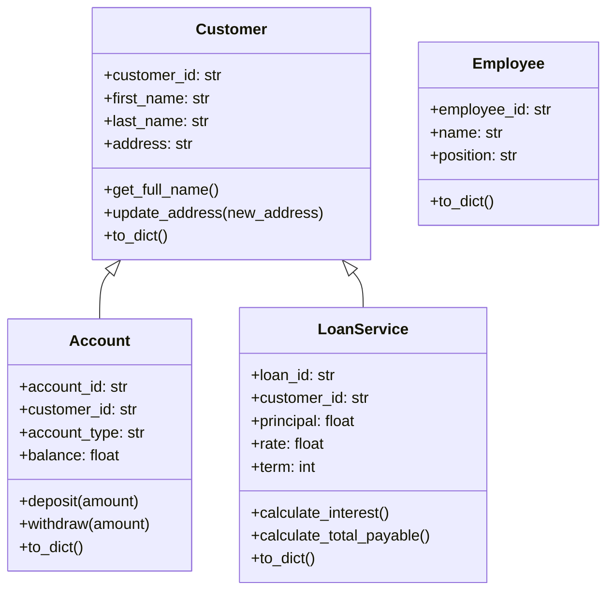

# UML Diagram

```mermaid
classDiagram
    class Customer {
        +customer_id: str
        +first_name: str
        +last_name: str
        +address: str
        +get_full_name()
        +update_address(new_address)
        +to_dict()
    }
    class Account {
        +account_id: str
        +customer_id: str
        +account_type: str
        +balance: float
        +deposit(amount)
        +withdraw(amount)
        +to_dict()
    }
    class Employee {
        +employee_id: str
        +name: str
        +position: str
        +to_dict()
    }
    class LoanService {
        +loan_id: str
        +customer_id: str
        +principal: float
        +rate: float
        +term: int
        +calculate_interest()
        +calculate_total_payable()
        +to_dict()
    }
    Customer <|-- Account
    Customer <|-- LoanService
```

This diagram shows the main classes and their relationships. `Account` and `LoanService` are associated with `Customer` via `customer_id`.
